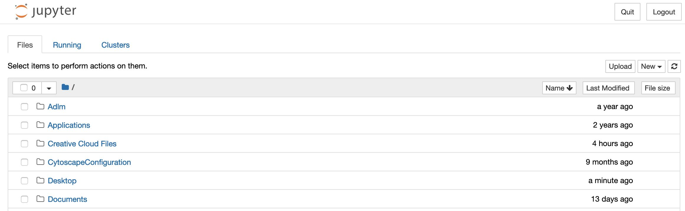
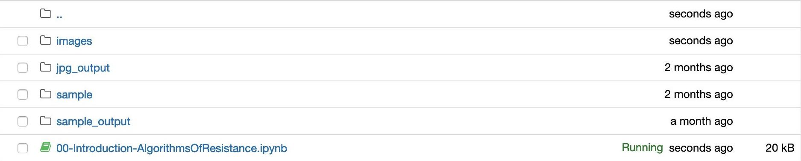

# Algorithms of Resistance: An Open Educational Resource

Ready to get started? Click the Launch Binder icon below to open the first module. *If you are opening Binder for the first time, please allow several minutes for it to load. It needs that time to set up your work environment.*

**Welcome!** Created by the *[On The Books](https://onthebooks.lib.unc.edu/)* team, these modules have been designed to introduce historians and programmers alike to the kinds of critical computational concepts and skills that can be applied in historical research.

## About *On The Books*

*[On The Books: Jim Crow and Algorithms of Resistance](https://onthebooks.lib.unc.edu/about/)* is a [collections as data](https://collectionsasdata.github.io/part2whole/) and machine learning project of the [University of North Carolina at Chapel Hill Libraries](https://library.unc.edu/) with the goal of discovering Jim Crow and racially-based legislation signed into law in North Carolina between Reconstruction and the Civil Rights Movement (1866/67-1967).

## About These Modules

As you go through each module, you'll encounter real examples based on work completed by the *On The Books* project, resources that will take you further on a range of topics, and scholarship on computational humanities and algorithms of resistance. Our aim in doing this is to encourage students and researchers to engage with corpus of North Carolina laws and Jim Crow laws as a site for important reckoning and research. We also hope that it provides a road map for those hoping to do similar work with their own states' laws or with other archival materials.

These modules are designed for learners with a range of programming experience. While some introductory understanding of Python will be helpful, you'll be able to complete the modules without having done any coding before. Collectively, the modules cover the following topics:

- information about how to organize, manage, and analyze a large group of historical texts;
- an introduction to ways historians can use programming to work with text;
- programming literacies that will help you better engage with and support your digital humanities collaborators.

## License

*These modules are licensed under the [GNU General Public License v3.0](https://github.com/UNC-Libraries-data/OnTheBooks/blob/master/LICENSE). Individual images and data files associated with these modules may be subject to a different license. If so, we indicate this in the module text.*

## Getting started

Each module is written in a Jupyter Notebook so that you can read the materials and run the code *in the same window*. You can also edit the code and take notes within the instructions if you like. With each module, we will introduce Jupyter concepts as you need them to complete the module.

**A <a href="https://jupyter.org/" target="blank">Jupyter Notebook</a> is an "an open-source web application that allows you to create and share documents that contain live code, equations, visualizations and narrative text."** (Jupyter.org)

The Jupyter Notebooks that make up this collection of modules are hosted online using **<a href="https://mybinder.org/" target="blank">Binder</a>, a service that hosts Jupyter Notebooks online.** [Using Binder](#online) is a great way to go through these modules in your own browser if you have a relatively stable internet connection and don't want to download additional software. However, we also provide instructions for downloading and running these modules [on your own computer](#local).

**If you are new to Jupyter Notebooks,** skip down to the "Access these modules" sections to learn more about how you can get started.

**If you are familiar with Jupyter Notebooks,** click the Launch Binder icon at the top of this page or below to get started:

## The modules

The modules in this open educational resource have been ordered based on text analysis workflows (from gathering data to data structuring to exploratory analysis), but feel free to choose which modules you'd like to work through. If it's helpful, you can keep this tab open or bookmarked in your browser so that you can use this list to navigate through each notebook.

### 00. Introduction - Algorithms of Resistance: An Open Educational Resource 

*15-30 minutes*

- An overview of the modules;
- an explanation of the workflow the modules follow;
- an overview of the modules' platform Jupyter Notebooks;
- and how to access the modules using Github and Binder *or* Anaconda.

### 01. What is an algorithm? 

*15-30 minutes*

- A brief explanation of what an algorithm is;
- discussion of the term "algorithms of resistance;"
- and a look at how algorithms are used for OCR and exploratory analysis.

### 02. Gathering a Corpus 

*30-60 minutes*

- A brief explanation of what a "corpus" is and its importance to text and data analysis;
- suggested methods for creating a corpus;
- an overview of corpus data structures and file formats;
- and two ways to gather a corpus from the Internet Archive.

### 03. Making a Corpus Computer Readable; or What is OCR? 

*30-45 minutes*

- An explanation of OCR (optical character recognition) and why it's important for digital research;
- a list of questions to consider when preparing a corpus for OCR;
- and an overview of OCR tools and platforms.

### 04. How To OCR with Python & Tesseract: The Basics 

*1-2 hours*

- An overview of the OCR process;
- how to pre-process texts for OCR;
- how to perform OCR using Python and Tesseract.

### 05. Structuring OCR'ed Text as Data 

*60-90 minutes*

- How to identify and address errors in OCR'ed text;
- how to structure OCR'ed text as data.

### 06. Exploring Structured Data from OCR'ed Text 

*1.5-2.5 hours*

- Research questions that can be asked and explored using structured data from OCR'ed text;
- ways to explore those questions using Python and Voyant.

## Access these modules online:

Follow these instructions if you have **relatively stable internet access**, are working on a laptop or desktop computer, and/or want to be able to save and access these files from multiple computers. *Note that these modules may work on a tablet, but they have not been tested.*

1. From the [*On The Books* website](https://onthebooks.lib.unc.edu/), click the Launch Binder button to open this first module in your browser:

2. OR from the [*On The Books* Github repository](https://github.com/UNC-Libraries-data/OnTheBooks), click the Launch Binder button next to any of the modules listed above to get started.

3. From either steps 1 or 2, you'll be sent to Binder where you'll see a loading page that looks like this:

 

4. The first time you open this page in Binder, it may take a moment to load.

5. When the Jupyter Notebook loads, you'll be in an environment that looks like this:

 

6. **Save the URL to this page** by clicking the Binder button in the Jupyter Notebooks menu so you can return to it later.

 

7. You're ready to get started. Begin from the top of the page and read down through the module. You'll learn what you need to use the notebooks as you go.

## Access these modules on your local desktop:

Follow these instructions if you have **limited or unstable internet access**, are working on a laptop or desktop computer, and/or want to work *mostly* offline. Note that parts of these modules will require internet access at specific points to download Python libraries and to gather data from archive.org.

1. Jupyter Notebooks can be created and edited on a computer with limited or no internet access through a free software package called [Anaconda Navigator](https://www.anaconda.com/products/individual). Begin by [downloading](https://www.anaconda.com/products/individual) the version of Anaconda that matches your operating system (Windows, Mac, or Linux). Make sure you select the version labeled "graphical installer".

2. When the software package finishes downloading, locate and open it and follow its instructions to complete installation. *Note that you may need administrator access to your computer to finalize installation. If you are working on a computer provided to you through your institution, check with the lab or computer administrator before attempting the install.*

3. If needed, see [these full instructions on installing and getting started with Anaconda](https://docs.anaconda.com/anaconda/install/).

4. Once Anaconda has been installed, launch the Anaconda Navigator.

5. (1) Click on the "Environments" tab on the left.

 

6. (2) Then click the "Create" button at the bottom of the Environments window. A popup box will appear.

 

7. We'll create a new environment, basically a space for your *On The Books* Jupyter Notebooks modules where your Python libraries and other settings will be saved. Give this new environment a name such as "onthebooks". Note that spaces are not allowed in the name. Click "Create".

8. You'll be returned to the Environments window. (1) Make sure that "onthebooks" or your environment name is selected in the middle panel. (2) Then, from the "Installed" dropdown menu, select "All." This will show a list of all Python libraries and modules available to be installed. (If you're not sure what a Python library is at this point, that's OK--just know that it's a package of code that can be used to extend Python's core functions--like a plug-in for a website or an add-on for software like Microsoft Word.)

 

9. In the search bar at right, (3) search for each of the following libraries. (4) Make sure that there is a green check mark next to each.

    - matplotlib
    - nltk
    - pandas
    - pillow
    - pyspellchecker
    - pytesseract
    - requests

10. (1) Return to the "Home" tab at left and (2) click "Launch" under Jupyter Notebooks:

 

11. Jupyter Notebooks will launch in your default browser. It will look something like this:

 

12. A Terminal or Console window will also launch. Keep this window and Anaconda Navigator open in the background while you work in your browser window!

 

13. In a new browser tab, navigate to the *On The Books* Github repository: [https://github.com/UNC-Libraries-data/OnTheBooks](https://github.com/UNC-Libraries-data/OnTheBooks).

14. **If you use Github** and have Github Desktop installed or know how to use the command line (Terminal) to access repositories, use your preferred method to clone the repository to your computer.

15. **If you do not use Github** and/or are not sure how to clone a Github repository, click the green "Code" button and then click "Download Zip." When asked, save the .zip file to an easily accessible location, such as your Desktop.

 

16. Navigate to the .zip file's location and (on a Mac) double click on it to extract the contents, or (on Windows) right-click and select "Extract All". When you've successfully unzipped the file, you should see a folder containing the Github repository contents.

 

17. Back in your browser in the Jupyter Notebooks tab, locate the *On the Books* Github folder on your computer. If you saved it to the Desktop, find the Desktop folder, click to open, then click to open the Github folder. Once you've found the Github folder, click to open the folder labeled "oer".

 

18. Click "00-Introduction-AlgorithmsOfResistance.ipynb" to open this notebook and get started. Note that the modules are numbered beginning with "00" and end in the file extention ".ipynb". If you get lost along the way, you can return here to find the module you were working on last or to move on to another module.

 

Now it's time to get started!

## Learn more about Jupyter Notebooks

If you want to learn more about Jupyter Notebooks before starting these modules, you can go through one (or more) of these tutorials:

- **Introduction Video (5 minutes):** ["Introduction to Jupyter Notebooks"](https://mediaspace.illinois.edu) by Ruohua Han for the Hathi Trust Research Center (2020).
- **Introduction Video + Notebook (15 minutes):** ["Getting Started with Jupyter Notebooks"](https://docs.tdm-pilot.org/intro-to-jupyter-notebooks/) by Nathan Kelber for JSTOR Labs (2020).
- **In-Depth Tutorial (1 hour):** ["Introduction to Jupyter Notebooks"](https://programminghistorian.org/en/lessons/jupyter-notebooks) by Quinn Dombrowski, Tassie Gniady, and David Kloster for The Programming Historian (2020).

## License

## Acknowledgments

This open educational resource was authored by Hannah L. Jacobs based on [code developed by the *On The Books* team](https://github.com/UNC-Libraries-data/OnTheBooks). Amanda Henley and Lorin Bruckner provided editorial feedback.
